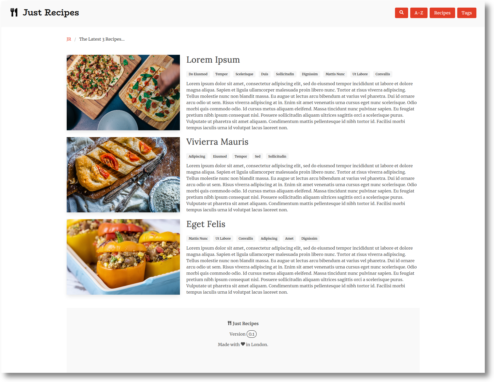

#  Just Recipes

## Synopsis

*Just Recipes* is a beautiful frontend for a recipe collection.

It uses a static site generator and a CSS framework, in this case [Gatsby](https://www.gatsbyjs.org/) in combination with [Bulma](https://bulma.io/).



(You can find more screenshots in the [screenshots](screenshots/README.md) subdirectory.)

## Data format

*Just Recipes* reads recipes in the [JSON-LD](https://en.wikipedia.org/wiki/JSON-LD) recipe format.

You can find information about the format on [schema.org](https://schema.org/Recipe) and on [Google Developers](https://developers.google.com/search/docs/data-types/recipe).

To add data, put:
- `JSON-LD` files in `data/jsons`,
- image files, which are referenced via `image_internal` in the `JSON-LD`, in `data/images/full`, and
- then rebuild the application.

(The sample images are sourced from [Unsplash](https://unsplash.com/).)

## Site map

- `/` - **Index** - Lists the latest 3 recipes.
- `/recipes/` - **Recipes** - Landing page to access recipes.
- `/recipes/page-<number>` - **Recipes numerical** - Lists all recipes with pagination.
- `/recipes/page-<letter>` - **Recipes alphabetical** - Lists all recipes alphabetical.
- `/recipes/<recipe>` - **Recipe Detail** - Shows one recipe.
- `/tags/` - **Tags** - Lists all tags.
- `/tags/<tag>` - **Tag Detail** - Lists all recipes for one tag.
- `/search/` - **Search** - Provides a full-text search.

## Usage & Development

To fire up *Just Recipes* and develop/build/and so on do the following:

```lang=shell
$ nvm install 10                                         # Make sure to have Node 10 installed
$ nvm use 10                                             # Make sure that Node 10 is selected
$ npm install -g gatsby-cli                              # Make sure Gatsby is installed
$ gatsby help                                            # Display Gatsby Help
$ gatsby develop                                         # Start development server
$ gatsby build                                           # Build a Gatsby App
$ gatsby serve                                           # Serve a Gatsby App
$ npm install --save bulma node-sass gatsby-plugin-sass  # Example of installing plugins
```

(When running `gatsby develop/build` with large data sets you probably need to increase the max memory for NodeJS: `export NODE_OPTIONS=--max_old_space_size=4096`.)

## Deployment & Hosting

Gatsby provides steps on deploying and hosting in their [documentation](https://www.gatsbyjs.org/docs/deploying-and-hosting/).

If you want to run *Just Recipes* in a Docker container follow those steps and use the `Dockerfile` provided in this repository:
```lang=shell
$ docker build -t jr:test .
$ docker run --name jr-test -d -p 80:80 jr:test
```

(The application will be available under `http://localhost/`, you might need to replace `localhost` with your Host IP depending on your network setup, e.g. if you're using a VPN.)